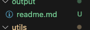

# Readme Generator
  
## Description

App to generate a professional readme file.

## Table of Contents 

[Installation](#installation)  
[Usage](#usage)  
[Credits](#credits) 
[License](#license)  

## Installation

N/A

## Usage

Type node index.js in the terminal to run the app and answer the questions.

Open the file in the output.

## Credits

N/A 

## License

This application is covered under the MIT licence.